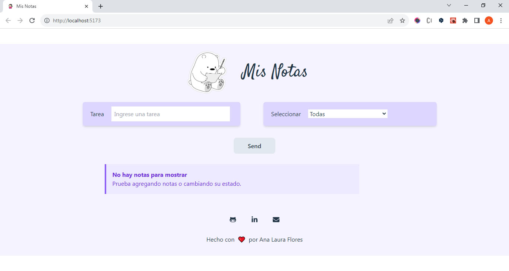
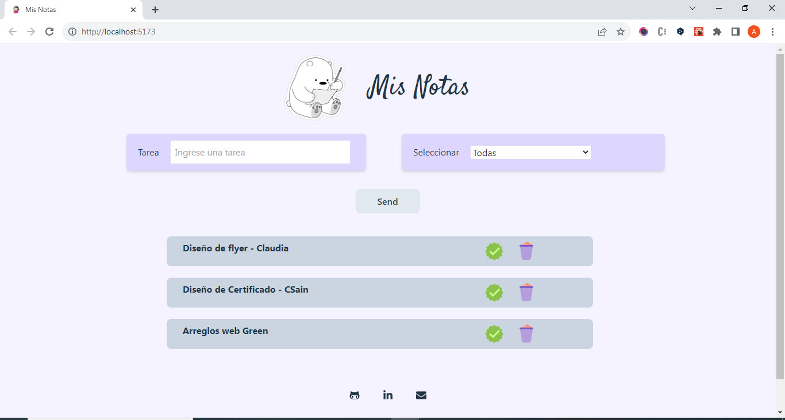
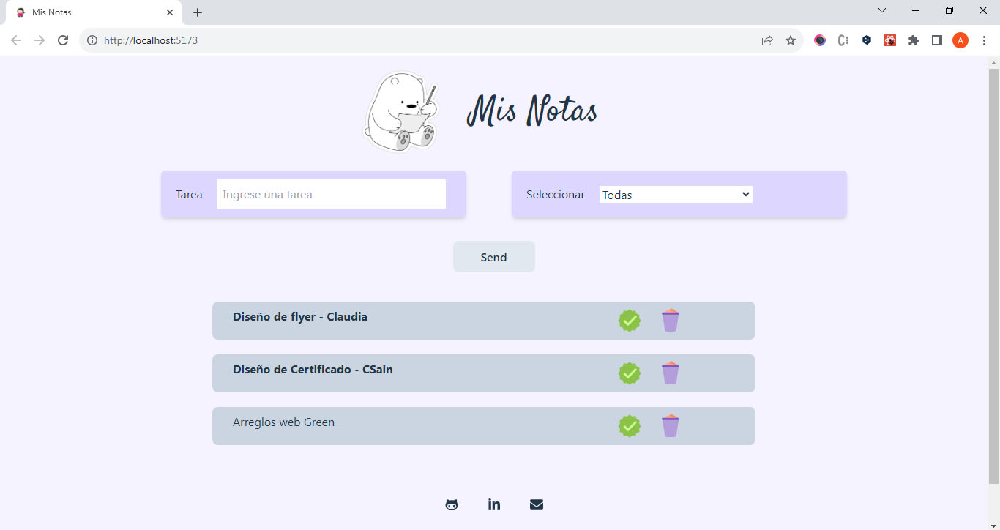
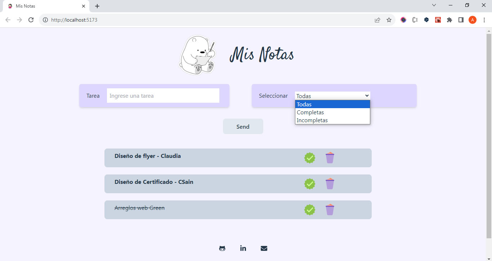
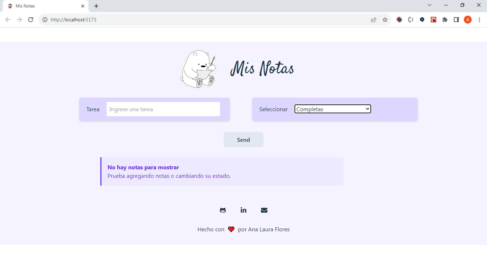

# Proyecto ToDoList - Proyecto React para Carrera Desarrollo Frontend ADA

 Es una aplicación de control de notas o tareas realizada con React(JavaScript). Desarrollado con Tailwind y vite 

 Corresponde al módulo V de la carrera de Desarrollo Frontend ADA - por lo cual es parte de un proceso de aprendizaje 

[link del proyecto](https://ana-laura-flores.github.io/ahorradas-proyect-javascript/)

 - Se utiliza tailwindcss para los estilos y se utiliza React JavaScript para lograr las funcionalidades de todo el proyecto.

  - Los datos se almacenan en el localStorage, mantiendo actualizada la info y los datos a cada momento.

  - Las tareas se podrán marcar como completas o desmarcar si están incompletas.

  - Hay un select que permite filtrar las notas/tareas y muestra según lo seleccionado, las que estan completas, incompletas o todas. 

  - Todas las modificaciones que se van haciendo se van actualizando en el localStorage.

 
  

## Es una aplicación para control de Tareas.
 

Podrás agregar tareas, marcar como completas o incompletas, filtrarlas.<em> Ideal para anotar todo lo que tengas que hacer y no te olvides de nada.</em>

 

 
 

Podes organizar mejor tu tiempo. <em>Organización y Control.</em>

 

 

Marcando las completas. <em>Tareas ya hechas.</em>

 

 

### A medida que vas cargando las notas se van visualizando en pantalla. Se muestran avisos de error en caso que no cumpla con los mínimos requisitos (nombre que contenga más de 5 caracteres) y se desabilita el botón para que las notas se agreguen
 

### El select de filtros permite mostrar las tareas completas, incompletas o todas.

### En caso que no haya notas para mostrarse se visualizará un mensaje para avisar que no hay notas para mostrar.

 

 Ana Laura Flores 

 (DISEÑADORA GRÁFICA UBA - ESTUDIANTE FRONTEND) 

